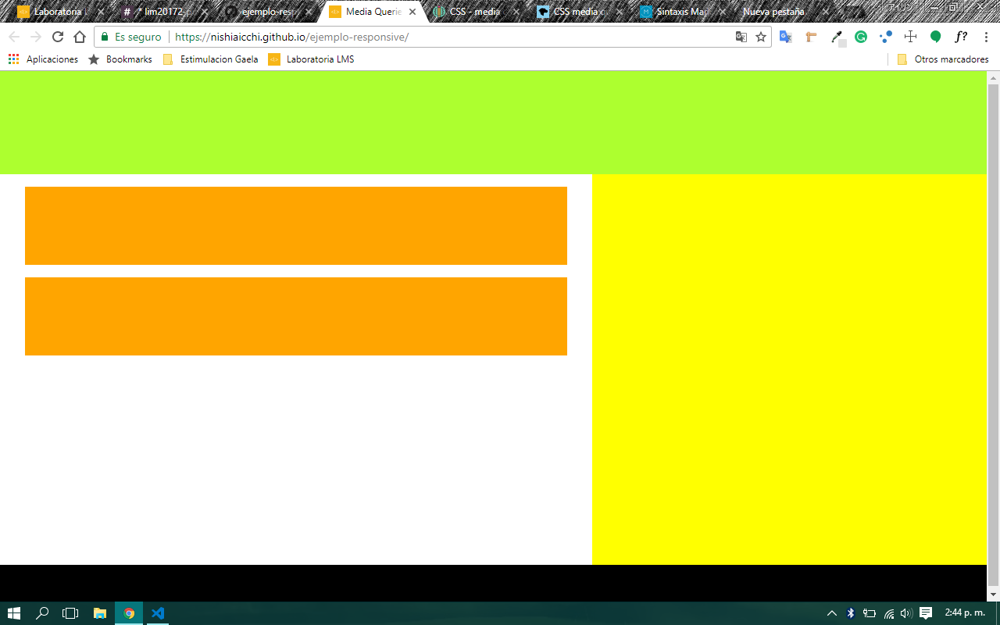

# Media Queries

+ __Sprint 03 - Unidad 01:__   
*Crea tu propia Red Social*

Este ejercicio fue creado para graficar el uso de los media queries en nuestras páginas web, volviendolas dinámicas y adaptables a los distintos tamaños de visualización que pudiera tener.

+ __Fuentes:__  
    [MDN web Docs](https://developer.mozilla.org/es/docs/CSS/Media_queries)  
    [Media Queries](http://es.learnlayout.com/media-queries.html)  

    + __Referencia:__  
    